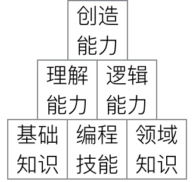

# 开始

<!-- toc -->

## 学习软件开发的几条主要途径

### 一万小时的神话

前一阵子我在网上与人讨论一个一万小时的话题。有一本叫做《异类》的书中说到这样的观点：世上本没有绝对的天才。天才也需要超过1万小时的训练。人人都有可能成为顶级高手。具体可以参考一篇流传甚广的文章《[怎样练习一万小时](http://www.geekonomics10000.com/519)》

在这种理论的基础上，有人提出了“一万小时编程训练”的概念，似乎经过一万小时以上的训练，普通人也有可能成为编程领域的“大师/高手”。但是，这个理论其实是一个貌似建立在统计学基础上的伪理论。

首先是范围，多大的一个范围，算是一个领域呢？编程是一个大的范围，编译器或者数据库编程是其中两个不同的领域。如果有人用一万小时专注于编译器的开发，他们对于数据库方面的编程，可能是一窍不通的。那么，这种人，算不算编程领域的大师呢？如果有人用一万小时专注于汇编语言的编程，那么对于新出现的面向对象的脚本语言，能够有多高的水平呢？

其次是训练，在一万小时的相关统计中，提到了舞蹈、音乐等众多需要反复练习的领域，而这种针对熟练程度的训练，真的是编程领域需要的吗？当然，我相信提高打字速度，的确有助于提高代码编写的速度，但是这真的有助于提高编程的能力吗？要想在软件开发这个领域，讨论如何才算是训练了一万小时的编程，会非常困难。

最后是关于知识更新，在一个每天都在诞生新名词，新技术，新思路的领域，一个曾经埋头苦练一万小时的高手，在3年不接触最新知识以后，还能称之为高手吗？

总之，匆匆忙忙的接受了一万小时的概念，被激励得热血沸腾，打算下定决心奋力学习一万小时编程，通常不过是“励志书中毒”的症状而已。

### 软件开发的能力体系是怎样的？

在很多领域，我们都可以用一个金字塔模型，来描述该领域的能力体系，在软件开发领域，同样如此。



简单解释一下：

低的三项，属于知识类。基础知识包括计算机、数学、算法、逻辑等等知识，这些知识，通过认真的学习书本教材，基本能够掌握。

编程技能，往往是跟具体的语言相关的，当然，多学几门不同的语言，对于快速掌握一门新的语言，大有帮助。

领域知识，则是与工作的具体方向有关，比如针对多媒体领域的编程，自然要熟悉图形、声音等等的相关领域知识。针对企业级应用的开发，对于管理制度、财务、成本、仓储的东西，总得搞清楚才行。

中与高的两项，属于超越编程局限的通用能力，不仅仅是软件开发上用得到，在各方面都非常需要这三类能力。逻辑能力，可以通过训练提高；理解能力，可以通过经验积累；而创造能力，的确比较难，有天赋的成分在其中。

### 有哪些途径，可以锻炼这些能力？

* 阅读与习题：找到一堆的经典教科书，狠狠的读，认真的把书里的习题都给做了，这样对于打下扎实的基础，将会有极大的帮助。
  
* 视频教程/ScreenCast：每次讲解一个主题，学习一下总会有收获，只是效率不高。
  
  * MOOC课程的出现，正在改变这样的现状，不过国内的MOOC课程大多是渣（简单的把视频教程搬上来就称为MOOC）
  * 我后面会推荐一些较好的MOOC课程，基本都是E文。
  
* PPT/Slide/PDF：这种属于某次技术会议上的演讲稿，如果能够配合视频看，效果还好些，否则通常会不知所云。
  
* Wiki：针对某个词条，某个特定的问题，会有相当清晰的解释，不过要看运气，有些词条的解释就非常粗略，甚至过时。
  
* Blog：在分享知识与经验的过程中，blog是很不错的载体，如果你能够找到的话。
  
* BBS：曾经是最主要的学习方式，很多人通过泡论坛来提高自己，不过说实话，效率很低，而且容易跑题。
  
* 邮件组：的确存在着不错的一些邮件组，不过不好找，欢迎多多推荐。
  
* 问答社区（StackOverFlow/Quora/知乎）：
  
  新兴的交流社区，在面临特定问题时，可以尝试搜索或提问。平时泡泡，努力回答别人的问题，也有助于自己的提高。
  
* 工作中的项目：当然，老板给你发工资，肯定希望你尽快完成，在压力之下，通常进步都会很快。只是这种进步也许是你无法选择的。
  
* QQ群：真的有人借助QQ群来学习吗？
  
* 开源项目/开源社区：当然，这个是最重要的，咱们下节详细说。

## 为什么要学习

学习有不同的目的：有人学习是因为兴趣或者好奇；有人是为了增加生存的技术，把学作为改变工作、生活状态的手段；当然，也有些人，学习是为了思想的交流，与周围的人交流，与远方的朋友交流，与过世的先哲交流。

静下心来，仔细想想自己为什么要学习很重要。如果学习的目的不明确，学习就缺少源动力。这种思考在学习之初是需要的，在学习过程中也同样是需要的。因为随着学习的进行，个人对学习的态度、感受也会发生变化，学习的目的也需要及时的调整。

一个善于学习的人，是能充分利用各种学习机会进行学习实践的人。有人七十多岁开始学画油画，也有人利用每天坐地铁的时间学会一门外语，甚至还有些人把微博、网络公开课作为学习的重要工具。只要学习目的明确了，学习就变成了一件有意义的事，因而才可能持久。

生物进化的几百万年，才使人类有了学习的能力，这种能力是区别与一般动物的。人类的学习是一个觉醒的过程，近百年人类文明高速演进，特别是互联网的出现，使学习的从原始的环境适应演进为主动的创造并迅速转为社会向上的推动力，或者破坏力。

### 为什么借助开源学习是最有效的

当今社会，大多数人都离不开机器的使用，而机器又依赖于程序的控制。学习编程不仅仅是软件工程师的事，它应该成为每个社会成员的一个基本的技能。正如语言是人类交流的基本技术，编程是人与机器交流的基本技能。学会编程，可以使机器按照你的意志运行，使每个人按自己的兴趣整合信息资源，以利于更有效的学习。

软件是近百年发展最快的技术之一，特别是随着智能手机与平板电脑的普及，软件技术更是渗透到了我们生活的各个方面。学会编程，并不意味着要去要去建一个复杂的系统。其实写个报表的计算公式或者做一个小动画也可以是一种编程的体验。

软件编程需要的基本环境就是一台电脑，当然如果有互联网的接入则更利于交流与技术信息的查询。

使用Linux最大的好处是它本身就是一个软件开发的开放平台，你可以方便地下载各种开发工具，比如gnu c/c++，python或者其它。你应该学会使用apt-get，这是一个Ubuntu下强大的软件包管理工具。

在网站kernel.org上，有各种版本的内核源代码，如果你想从根本上学习操作系统，也可以通过LFS快速地学习内核构建的过程。

源代码开放的最大的好处是我们不需要重复设计和制造轮子。每个人都可以在软件巨人的臂膀上构造自己的梦想代码天堂。

无论从美国的facebook、谷歌、苹果还是从中国的华为成功的经验中我们都可以看到，开源的代码以及开源的项目是当前众多商业公司的技术立足之根本。开源已经造就了无数商业神话。我们大部分人只知道苹果的酷，但很少有人在苹果的版权说明中，看有关开源项目的罗列。

微软的比尔盖茨以及苹果的乔布斯大家耳熟能详，但对软件产业最有影响力的人应该是出生于芬兰的李纽斯(Linus Torvalds)。谷歌正是采用Linux为内核，才使android几乎在一夜之间窜红并重创诺基亚。而李纽斯在软件界的影响力，堪比罗马教皇。

有一部电影叫源代码，也是对代码开源化的一个隐喻。如果你读到了关键的源代码，也许你真的可以改写历史。当然，李纽斯说得很好，开源应该是快乐的，“Just for fun”。我们不需要太多的使命感与焦虑，改变世界也许只是一个顺带的结果。

源代码是我们最好的营养。

### 方向不对，努力白费

在中国，如果你想面朝大海，应该是一路向东。当然向西也是可以的，不过要多费些周折。技术的更新非常快，但如果把握了大势往往可以事半功倍。

举一个实际的例子：十多年前，PHP是一个相对冷门的编程工具。在很多场合，很多人都不好意思说自己是搞PHP开发的。而如今，PHP已经成为主流的开发工具，很多搞.net的人出于生计的考虑，不得不转向Java或者PHP。

> 这个例子不妥，语言只是载体，工具，任何语言都能达成自己的目的。
> 
> 以前父母总是以这样的方式去教育孩子，这个专业（语言）很热门，薪水很高...

选择开发工具只是软件工匠们需要认真定夺的一个方面。其它如系统构架、测试方法、团队管理、决策者眼光等等，更是关系每个程序员未来的诸多要素。

### 开源的精神内涵使学习变得更加有意义

在商业极度发展的今天，人们对物质的无限追求使很多人忘记了生活的本质。人被异化为物的附属品，价值被虚拟的概念、标签重置。

互联网的出现，促进了人类相互之间的沟通。软件高速更新发展的自然需求和因团队协作所带来的有效性、高效性造就了一个全新的文化：开源文化。软件便与分享、开源代码便于扩展的特质，使以Linux操作系统为代表的开源项目迅速崛起。大批的软件工程师不仅通过开源项目找到的精神寄托、同道中人，而且还找到了与商业社会有效融合的模式与渠道，解决了事业与兴趣结合问题，实现了生活、学习、工作甚至社会公益有完美统一。

在开源精神的感召下，学习变得更加积极主动。

在分享、贡献的核心价值体系下，人们能充分体会人心温情的另一面。与传统商业社会利用信息不对称在交易中图谋利益最大化不同，开源世界里的人们在创造、协作的过程中完成一个又一个不断成长的软件系统，这些系统有些使整个社会运行更有效、当然也有的在损坏甚至危及社会的安全。人类精神世界的两面性在开源世界里更直接、更激烈地表现出来，正在影响着现实的诸多方面。

### 开源社区是最好的学校

软件是构建虚拟世界的基础，而开源社区则是软件新技术产生、发展的主要场所，因而也是学习软件技术最好的学校。

当前最大的网络社区应该算游戏社区，这个社区的人大多是在消费社会资源。而开源社区则分化成两个阵营：一个是以创新、创造为目地的，创造社会价值；另一个则是以破坏、非法取得信息资源为目地，损毁社会资源与体系。

在开源社区里，有大量热心的程序员，他们乐于分享自已对技术的理解、心得，他们通过各自的行动扩大自已的影响力，在协助别人的同时不断加深自己对技术的理解程度和实践能力。而新的社区加入者也可以在与社区互动的过程中找到自己技术与精神的导师(Mentor)，正如电影黑客帝国(Matrix)中尼欧(Neo)遇到摩菲(Morpheus)。

如果说我们生话的世界是上帝创造的，那么我们对面的这个数字的世界则是由程序员创造的。数字世界与现实世界不断地融合，使现实世界与虚拟世界的边界变得越来越模糊。在学校课堂里，陈旧的教学方法、过时的教学内容、有限的学习资源是无法与互联网上丰富的开源社区资源相比的。社区内部团队协作的自发性、自主性、可靠性也极大地提高了社区成员学习的效率，并使个体超常规成长成为可能。

在媒体上经常看到十、三四岁的少年创造一个个软件项目的奇迹，殊不知这与国外成熟的开源社区发展息息相关。如果国内开源社区渐渐发展起来了，我们有理由相信在不久的将来，我们的周围会出现众多皮尔斯·富里曼(Pierce Freeman)这样的天才少年。

### 移动互联网时代，学习是开放的更是开源的

随着智能手机、平板电脑的普及，学校以及教室的功能将被弱化，人们可以在各种公共场所组成形式多样的学习社区。而开源社区提供多种专业技术人员以及业余爱好者面对面交流的机会。有的地方还出现了包括软件、硬件开源的创客空间。大家在无线网络环境下快速组成学习社区，分享交流最新的技术，互相协助解决各种技术问题。发现的志同道合的朋友，有的技术团队在天使投资者的支持下，在学习的过程中还可以建立创业团队。

在企业的内部，根据企业的发展战略，也可以形成企业内部的开源社区，通过开源项目整合企业内部与外部的技术资源。开放的心态使企业以开源文化的发展为契机引领技术的潮流。


## 在学习一门语言之前

你至少应该对计算机科学有所了解，当然你也可以不管不顾，在没有任何基础的情况下，直接开始学习一门编程语言，但是，随着面对的问题越来越困难，你还是会深切感受到，补习基础知识的重要性。

这里推荐一个不错的计算机科学入门MOOC课程:

[斯坦福大学 计算机科学入门课程](https://www.coursera.org/course/cs101)

它面向无任何基础的学生，介绍计算机科学的基本知识:

* 计算机和代码的本质，它们能做哪些事情，不能做哪些事情
* 计算机硬件如何运作：芯片、CPU、内存和存储设备
* 必备术语：bits（二进制位）、bytes（字节）、megabytes（百万字节）、gigabytes（千兆字节）
* 软件如何运作：什么是程序，什么叫做“运行”
* 数码图片是如何实现的
* 计算机代码：循环和逻辑
* 大概念：抽象、逻辑和程序缺陷
* 结构化数据是如何实现的
* 互联网是如何实现的：ip 地址、路由、以太网、wi-fi
* 计算机安全：病毒、木马和密码，噢我的天啊！
* 模拟和数字
* 数字媒体、图片、声音、视频、压缩

在了解了计算机科学之后，你就可以开始选择一门语言来进行学习。

## 选择一门语言

**首先需要说明，这里所讨论的选择语言，并非工作中开发语言的选择，而是出于学习软件开发，提高软件开发能力的目的，讨论如何选择语言。**

### 一些基本的判断依据

* 最好是跨平台/平台无关的语言。比如Java、Ruby、Python、PHP、JS这样的语言。
  
  .NET平台的众多语言，因为mono的存在，现在也算是跨平台的了。
  
* 这门语言所创建的开源项目，要足够多，可供选择。C/C++、Java、Python、PHP都
  
  可以非常好的满足这个条件，随着github平台的出现，Ruby的开源项目现在也越来越
  
  多的了。随着nodejs的兴起，JS的开源项目也呈现明显的上升趋势。
  
* 语言以及语法本身，要具备较好的可读性。这里我非常推崇Ruby，因为这门语言从创立
  
  之初，就是极端重视代码可读性的，整个Ruby社区的风格，也非常强调代码的简洁优雅。
  
* 相关的文档资料容易查找，这方面大多数流行语言都符合条件。C/C++、Java、PHP、C#、
  
  Python都已经极为丰富了。
  
* 最好身边有能够随时请教的这门语言的高手。如果有了这一条，其他都无所谓了。
  
* 最好能够至少分别学习一门静态类型语言与一门动态类型语言。

### 推荐一些语言学习网站

* 《笨办法学语言》系列，详见下节的介绍
* [CodeCombat](http://codecombat.com/) 通过游戏闯关，一步一步学习语言，而且这还是一个开源项目
* [指导开发者快速学习编程的网站推荐](Useful-Websites-to-Learn-How-to-Code-Quickly.md)
* 当然，各个语言的官方网站，是必须常去的

### 一些忠告

* 不要根据流行的编程语言排行榜，选择语言
  
* 不要根据某某语言最容易找工作，薪酬水平最高，来选择语言
  
* 不需要贪图掌握太多的语言
  
  越是深入的学习一门语言A，越是能够快速的学习另一门语言B。A和B可以是任何两种语言。努力深入透彻的掌握目前正在使用的这门语言，深入、再深入。这些努力，在你以后要学习其他语言的时候，一定会有回报的。

### 一点建议

* 选择深入的语言,其实就是选择一种生活方式
* 各种开发语言都有最适合的工作领域
* 各种开发语言的技术社区在中国各自有各自的文化
* 选择日常可以用到的开发语言深入进去，事半功倍 ;-)
* 选择hacker 界公认的好语言，坚持学习，总是能得到养份的,获得多少,看能坚持多久！
* 这里公认的是指 Lisp —— Paul Graham在The root of LISP 里曾经曰过：

> “吾观之，自古语言模型者，惟 C 与 LISP 简洁而隽永，高山仰止，
> 
> 后来者皆取 C 之形，循 LISP 之神也。”

### 推荐语言

**这个列表，可以不断扩充，也欢迎大家补充自己的推荐语言与推荐理由**

首选语言:

如果以常规的应用开发为目的来学习一门语言，那么面向对象类型的语言(java,freePascal,.net)能

够让你养成严谨的基于对象分类思索模式的开发习惯，这会是一个好的开始。

如果是为了快速开发建站，那么php,ruby, nodejs,python不失为一个选择。

不过可能到了后面需要补坑。

| 语言名称   | 主要开源项目                    | 推荐理由                                     |
| ------ | ------------------------- | ---------------------------------------- |
| ruby   | Ruby On Rails             | 动态语言，简洁清新                                |
| java   | Tomcat                    | 经典的面向对象静态语言，长盛不衰，优秀项目多如牛毛                |
| python | scipy, nltk, django, ansi | 最接近人类语言的通用语言，在开源的科学计算领域一骑绝尘，在数据挖掘、web开发、系统管理等领域也为表现突出 |
| c      | lua,mongrel2              | 面向过程的，存在于所有平台，历史悠久的语言。如果你的未来应用方向是嵌入式开发的话这是首选 |
| nodejs | sails.js,angular,coffee   | 疯狂的科学家们在用js做一系列的不可思议的事情，有一统的趋势           |

[对比语言元素: PHP, Perl, Python, Ruby](http://hyperpolyglot.org/scripting)

其实选用哪一个语言并不重要，关键是你要能使用该语言去控制，去驱使计算机。

## 必须初步掌握的基本功

以下所讨论的基本功，其实是一个相当宽泛的概念。很难确切的定义一个门槛：不到某种程度，你就无法学习开源了。而是说，在掌握了一些必要的能力之后，再开始学习，会学得不那么幸苦。

### 计算机基础知识

计算机相关的基础知识，其实相当琐碎，很多人都是在日常的使用与开发过程中，逐步掌握的。在了解各种各样的零零碎碎的知识同时，对于各种知识及其相互关联，有一个整体上的把握，我称之为“地图思维”，是非常重要的。

简单来说，计算机相关的基础知识主要包括：基本操作与使用；计算机体系结构；网络基础知识；算法导论等等。

* 计算机操作与使用：
  
  * 会初步使用至少一种操作系统吧；
  * 会自己装一个虚拟机（VirtualBox什么的都可以）；
  * 知道常见的文件格式如何打开；
  * 知道去哪里下载并安装相关的应用软件；
  * 诸如此类的知识。推荐一个网站：[我爱电脑网](http://www.woaidiannao.com/)真心觉得不错，那些乱七八糟的广告可以略过。
  
* 计算机体系结构(组成原理)：
  
  * 《[深入理解计算机系统](http://book.douban.com/subject/5333562/)》
    
    书评:《[NB学校的NB课程的NB教材--CSAPP](http://book.douban.com/review/3150951/)》
  
* 网络基础知识：
  
  * 《[计算机网络](http://book.douban.com/subject/1179807/)》，
    * 书评:《[我看过的最好的网络入门书](http://book.douban.com/review/2304950/)》
  
* 算法与设计：
  
  * 《[Algorithms](http://book.douban.com/subject/4854123/)》
    * 书评:《[大家好，我是译者](http://book.douban.com/review/5337314/)》
  * 《[设计模式 可复用面向对象软件的基础](http://book.douban.com/subject/2279416/)》
  * 《[代码大全](http://book.douban.com/subject/1951158/)》
  * 《[程序设计实践](http://book.douban.com/subject/1096711/)》
  
* 数学基础:
  
  * 《[具体数学-计算机科学基础](http://book.douban.com/subject/1231910/)》
  
* 语言:
  
  * [java编程思想](http://book.douban.com/subject/2061172/)
  * [Google Java 编程规范](http://google.github.io/styleguide/javaguide.html)
  * [C编程一站式学习](http://akaedu.github.io/book/)

### 至少掌握一门编程语言

听上去似乎是废话，如果连语言都没有掌握，怎么可能开始学习开源软件，看人家的源代码呢？不过，怎么才算掌握了一门语言呢？能够写出Hello World，自然是不算的。掌握这门语言的基本语法，肯定也是不够的。也许找一本某某语言的经典教材，然后把后面的习题都给做出来，的确算是一个简单的办法。不过，编程语言实在太多，相关的经典教材，就更是多不胜数。这里就不再一一推荐了。

不过特别想推荐一个《笨办法学语言》系列，目前有：Python、Ruby、C、Regex、SQL、CLI六种。引用我觉得最有道理的一段话： “不要复制粘贴。你必须手动将每个练习打出来。复制粘贴会让这些练习变得毫无意义。这些习题的目的是训练你的双手和大脑思维，让你有能力读代码、写代码、观察代码。如果你复制粘贴的话，那你就是在欺骗*自*己，而且这些练习的效果也将大打折扣。” 相关链接如下：

* [Learn code the hard way](http://learncodethehardway.org/)
* [《笨办法学 Python 》在线中文版](http://readthedocs.org/docs/learn-python-the-hard-way-zh_cn-translation/en/latest/)
* [Python初学者（零基础学习Python、Python入门）书籍、视频、资料、社区推荐](https://github.com/Yixiaohan/codeparkshare)

### 熟练掌握搜索引擎的使用

* 第一戒律：尽可能在Google，而不是Baidu搜索。对于软件开发而言，Google才是最佳武器。
* 不断的积累关键字：一个内容你搜索不到，只是因为你没有听说过那个关键字。比如，我想要找一个图像处理的开源项目，如果你知道 “Computer Vision”是指计算机视觉，那么直接搜“Open Source Computer Vision”,OpenCV一定就会是第一个结果。如果你知道OpenCV，那么想要找一个2D图像转换成3D图像的技术，有没有开源实现，就可以试着搜“2D to 3D OpenCV”，也许就会更快的找到想要的内容。当你对某个领域完全没有了解时，可以先试着搜索一些周边词汇，看看相关的文档，然后了解行内人是用哪些关键词的，然后再去搜索，就会迅速的缩小范围。
* 搜索出错信息：当然，当你遇到错误时，直接把错误输出放到Google里去搜索，也说不定就会遇到和你有相同遭遇的同学，看看别人是怎么解决的。
* 尝试各种专业的、垂直的搜索引擎：比如StackOverFlow或者Quora这样的专业问答社区，koders 则是一个源代码搜索的引擎。google search里的Blog、Discussions里也有不少好东西。
* 2019Google镜像地址：http://ac.scmor.com/ 包含谷歌学术镜像与网页镜像。
* ~~到百度试试手气：毕竟人家也抓了不少网页了，说不定会有Google没抓到的呢？~~
  * 不，任何时候，都不要去百度碰运气，你可以选择的搜索引擎有很多：Bing、Yahoo...

### 英语不能太差

当然，这个更加是没底的事情，只是我自身英文也非常差，所以没资格教育别人，推荐余晟老师的一篇博客，供大家学习：[《关于程序员学英语的经验》](http://www.luanxiang.org/blog/archives/1236.html)


## MOOC 课程

注意: **绝大部分是英文课程**

### Python

* [计算机科学及Python编程导论](https://www.edx.org/course/introduction-computer-science-mitx-6-00-1x-0#.U_HC-_mSxSU)
  
  * 这个是非常棒的计算机开发入门课程(授课老师Prof. Eric Grimson是MIT的副校长)
    
    不过是用python语言作为示范讲解的.
    
  * [中文字幕](http://open.163.com/special/opencourse/bianchengdaolun.html)(建议和英文字幕对照看)

### Java

1. [Intro to Java Programming Building Programs with Classes & Objects](https://www.udacity.com/course/intro-to-java-programming--cs046)
2. [Java编程导论 - 第1部分：开始使用Java编程](https://www.edx.org/course/introduction-programming-java-part-1-uc3mx-it-1-1x#.VQZrMo6Ueo0)
3. [Introduction to Java Programming – Part 1](https://www.edx.org/course/introduction-java-programming-part-1-hkustx-comp102-1x)
   * (香港大学 港式英语很High)

### C

* [程序设计入门——C语言（浙大）](http://www.icourse163.org/course/zju-199001#/info)
* [计算机程序设计-C 台湾大学](https://www.coursera.org/course/cprogramming)

### 计算机体系结构(组成原理)

* [The Hardware/Software Interface](https://www.coursera.org/course/hwswinterface)
  * 这门Coursera的课程几乎完全取材于《深入理解计算机系统》这本书，连编程作业都是完全照搬CSAPP在CMU的作业
  * 很棒
  * 先修知识:
    * Introductory programming in C or Java
    * familiarity with binary numbers

### 算法

* 算法
  * [算法，第一部分(普林斯顿大学)](https://www.coursera.org/course/algs4partI)
  * [算法，第二部分(普林斯顿大学)](https://www.coursera.org/course/algs4partII)
  * 教材：《[Algorithms](http://book.douban.com/subject/4854123/)》

## 关于开发工具

* 关于这个话题，我在知乎上发起了一个话题，欢迎参考。[关于开发/编程工具，你有哪些心得或给初学者的建议？](http://www.zhihu.com/question/20302904)
* 过犹不及：所有的工具，都是为了提高我们的开发效率而存在的，但是，如果为了那些工具，投入了太多的精力，则可能舍本逐末，忘记了自己的根本目标。也许有人会说，磨刀不误砍材功，但是，千万不要只顾磨刀，忘记砍材啊。
* 对于初学者而言，GUI是更加自然的方式。虽然，计算机的发展过程，是先有命令行，后有图形界面。但是，键盘、鼠标的综合运用，会更加容易被人掌握。当然，随着熟练程度的增加，纯用键盘操作，加上花样繁多的快捷键，会大大的提高操作的效率。再进一步，有一些优秀的GUI工具，极其丰富的支持各种快捷方式，同时又兼顾图形界面的美观与方便，是最值得推荐的。但是，还是回到那句话：过犹不及。
* 好的教程，会帮助我们的熟悉开发工具，我一直认为TextMate的迅速普及，是由于RailsCast的功劳。因此，花时间找一些靠谱的教程，尤其是视频教程，会很有效。
* 开发人员，往往会有两个误区，或者频繁的挑选、比较多种开发工具，或者长时间埋头于自己最常用的那个工具，对于外面世界的发展毫无兴趣。我的个人建议是，定期抬起头来，看看新工具的进展与介绍。1～2年为一个周期就好，不用太频繁。
* 知其然，更要知其所以然。千万不要变成被工具惯坏了的程序员。
* 不要总试图要汉化它（by 李焕林）
* 工具是给懒人用的，不是给傻子用的。（by 程劭非）
* 还会不定期的补充一些心得进来...

### 关于开发工具的分类（by 李路）

我认为开发工具分三类，需区别对待：

1. 可以使用一辈子的工具，学习路径几乎没有尽头，值得在职业初期就好好考虑，仔细斟酌进行选择，并在整个生涯中不断努力力求学到更多，你的工作效率会因为这种努力不断提高。如：
   
   ``` 
   * 编辑器： emacs, vim
   * 基本操作系统环境：如bash
   * 基本编程语言: c / lisp 
   ```
   
2. 任何时候都需要掌握的工具，这类工具总是每隔一个周期就有新的产品出现，取代掉旧有的产品，但相对来说是值得学习的，能保持一个较长的时代的有效期，如：
   
   * 版本控制系统：git
   * 社交网络: stack overflow / github
   * 写作工具: markdown / reStructureText / latex / html
   * 通用编程语言： python / ruby / javascript
   
3. 特定领域需要的工具，此类工具往往时效性较短，不断被新产品取代，一旦掌握，能在特定领域获得非常高的效率，但缺点是很快会过期，通常是几年之内
   
   * 各类编程框架：rails / backbone
   * 各类测试框架：xunit / rspec
   * 用户行为分析工具： ga
   * 各类设计工具： balsamiq
   * 各类项目管理，代码集成工具: github / trac / basecamp / redmine

### 各种参考资料

以下链接尽可能都给英文维基百科的link，分类页尽可能给维基百科里的Category页

* [Programming tool](http://en.wikipedia.org/wiki/Programming_tool)
* [Text editors](http://en.wikipedia.org/wiki/Category:Free_text_editors)
  * [Emacs](http://en.wikipedia.org/wiki/Emacs)
  * [Vim](http://en.wikipedia.org/wiki/Vim_%28text_editor%29)
  * [JEdit](http://en.wikipedia.org/wiki/JEdit)
  * [Notepad++](http://en.wikipedia.org/wiki/Notepad%2B%2B)
  * [Sublime Text](http://en.wikipedia.org/wiki/Sublime_Text)
  * [Atom](https://atom.io/) Github 出品 纯coffeescript(nodejs)开发，我喜欢
* [Integrated development environments](http://en.wikipedia.org/wiki/Integrated_Development_Environment) / [IDE List](http://en.wikipedia.org/wiki/Category:Free_integrated_development_environments)
  * [Emacs](http://en.wikipedia.org/wiki/Emacs)
  * [Dev-C++](http://en.wikipedia.org/wiki/Dev-C%2B%2B)
  * [Eclipse](http://en.wikipedia.org/wiki/Eclipse_%28software%29)
  * [NetBeans](http://en.wikipedia.org/wiki/NetBeans)
  * [Cloud9 IDE](http://en.wikipedia.org/wiki/Cloud9_IDE)
  * [Code::Blocks](http://en.wikipedia.org/wiki/Code::Blocks)
  * [KDevelop](http://en.wikipedia.org/wiki/KDevelop)
* [Revision control software](http://en.wikipedia.org/wiki/Category:Free_revision_control_software)
  * [SVN](http://en.wikipedia.org/wiki/Apache_Subversion)
  * [Git](http://en.wikipedia.org/wiki/Git_%28software%29)
  * [Mercurial](http://en.wikipedia.org/wiki/Mercurial)
* [Test-driven development](http://en.wikipedia.org/wiki/Test-driven_development) / [Behavior Driven Development](http://en.wikipedia.org/wiki/Behavior_Driven_Development)
  * [xUnit](http://en.wikipedia.org/wiki/XUnit)
  * [RSpec](http://en.wikipedia.org/wiki/RSpec)
* [Rapid prototyping tools](http://garmahis.com/reviews/wireframe-tools/)
  * [Balsamiq Mockups](http://en.wikipedia.org/wiki/Balsamiq)
  * [Axure RP Pro](http://en.wikipedia.org/wiki/Axure_RP)
* [Project management software](http://en.wikipedia.org/wiki/Category:Free_project_management_software)
  * [Bugzilla](http://en.wikipedia.org/wiki/Bugzilla)
  * [XMind](http://en.wikipedia.org/wiki/XMIND)
  * [Redmine](http://en.wikipedia.org/wiki/Redmine)
  * [Trac](http://en.wikipedia.org/wiki/Trac)
  * [MediaWiki](http://www.mediawiki.org/wiki/MediaWiki)

### 关于英文资料

回应Shi YiMin的评论："大学一、二年级的新生看这个英文的资料是不是会有点困难？"。

我觉得，还是要努力的去看吧，如果发现理解有困难，再去寻求各种帮助。毕竟相比对应的中文版，英文版的内容质量要好得多。再者，维基百科里的这些内容，主要还是简介性质的，不算太难。


[上一章](Before-start.md) | [下一章](Select-an-open-source-project.md)
